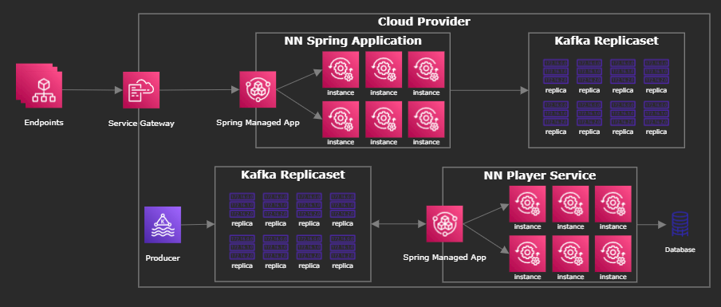

<div align="center">

# NN Spring Application

</div>

The NN Spring Application is an exercise for onboarding new Team members.

This application exposes some API endpoints and sends the data to Kafka queues.

Made it simple, not over-engineered, showing how two services communicate with each other.

<div align="center">

[](https://github.com/tihlok/nn-spring-application)

[](https://github.com/tihlok/nn-spring-application)
[](https://github.com/tihlok/nn-spring-application)
[](https://github.com/tihlok/nn-spring-application)
[](https://github.com/tihlok/nn-spring-application)
[](https://github.com/tihlok/nn-spring-application)
[](https://github.com/tihlok/nn-spring-application)

[](https://sonarcloud.io/summary/new_code?id=tihlok_nn-spring-application)
[](https://sonarcloud.io/summary/new_code?id=tihlok_nn-spring-application)
[](https://sonarcloud.io/summary/new_code?id=tihlok_nn-spring-application)
[](https://sonarcloud.io/summary/new_code?id=tihlok_nn-spring-application)
[](https://sonarcloud.io/summary/new_code?id=tihlok_nn-spring-application)
[](https://sonarcloud.io/summary/new_code?id=tihlok_nn-spring-application)
[](https://sonarcloud.io/summary/new_code?id=tihlok_nn-spring-application)
[](https://sonarcloud.io/summary/new_code?id=tihlok_nn-spring-application)
[](https://sonarcloud.io/summary/new_code?id=tihlok_nn-spring-application)
[](https://sonarcloud.io/summary/new_code?id=tihlok_nn-spring-application)
[](https://sonarcloud.io/summary/new_code?id=tihlok_nn-spring-application)
</div> 

_____

<div align="center">

## Getting Started

</div>

These instructions will help you setup and run the service on your local environment in no time!

_*For sake of simplicity this document will focus on MacOS commands._

### Prerequisites

For this to work, you should have some things installed on you computer:

```bash
# install Homebrew
$ /bin/bash -c "$(curl -fsSL https://raw.githubusercontent.com/Homebrew/install/HEAD/install.sh)"
# install asdf
$ brew install asdf
# install Java JDK 17
$ asdf install java openjdk-17.0.2 
$ asdf global java openjdk-17.0.2
$ java -v
# install Gradle
$ asdf install gradle 7.5.1 
$ asdf global gradle 7.5.1
$ gradle -v
```

Download [Docker](https://www.docker.com/) and install it.

### Running

Lets keep everything organized!

```bash
# create a folder for the projects
$ mkdir -v -p ~/dev/nn
$ cd ~/dev/nn

# clone the repository
$ git clone git@github.com:tihlok/nn-spring-application.git
$ cd nn-spring-application
```

You need to setup some environment variables.

```bash
# REQUIRED


# OPTIONAL
SONAR_TOKEN=
```

Let's run it through docker:

```bash
$ docker compose up  
```

<div align="center">

## Testing

</div>

```bash
$ gradle test
```

<div align="center">

## Security

</div>

_*WIP_


<div align="center">

## Technology Stack

</div>

| Technology                                                    | Description                                                                                        |
|---------------------------------------------------------------|----------------------------------------------------------------------------------------------------|
| [Spring Boot](https://spring.io/projects/spring-boot)         | Core framework                                                                                     |
| [Spring Security](https://spring.io/projects/spring-security) | Security framework for the JWT tokens                                                              |
| [Kafka](https://spring.io/projects/spring-kafka)              | Streaming data pipelines                                                                           |
| [Gradle](https://gradle.org)                                  | Dependency management                                                                              |
| [Swagger](https://swagger.io/)                                | Generate and provide documentation for the endpoints                                               |
| [Lombok](https://projectlombok.org/)                          | Automatically generate boilerplate code for getters, setters, equals, toString, logging, and so on |
| [Docker](https://www.docker.com/)                             | Container for the application                                                                      |
| [Sonarcloud](https://sonarcloud.io/)                          | Code quality platform                                                                              |

<div align="center">

## Architecture

[](docs/arch-design.png)

</div>

<div align="center">

## Folder Structure

</div>

```text
.
├── .gitignore
├── .github
│   └── workflows
│
├── gradlew
├── gradlew.bat
├── gradle
│   └── wrapper
├── build.gradle
├── settings.gradle
├── gradle.properties
|
├── lombok.config
│
├── src
│   └── main
│       ├── resources
│       └── java
│           └── nl.nn.app
├── src
│   └── test
│       ├── resources
│       └── java
│           └── nl.nn.app
│
├── docker-compose.yaml
├── Dockerfile
│
├── LICENSE.md
└── README.md
└── CHANGELOG.md
```
